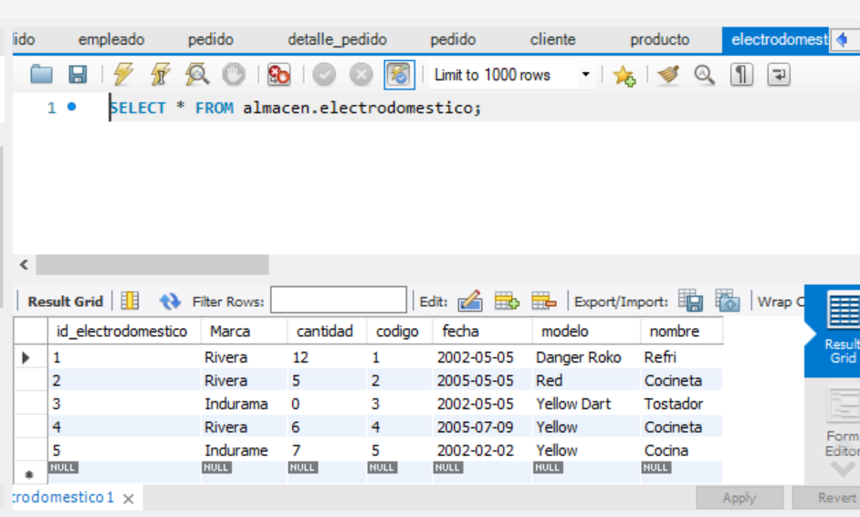
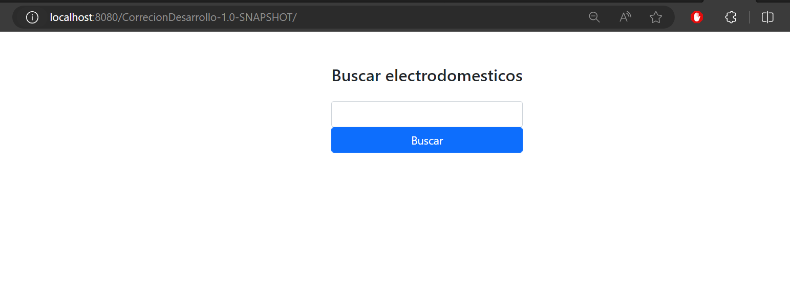
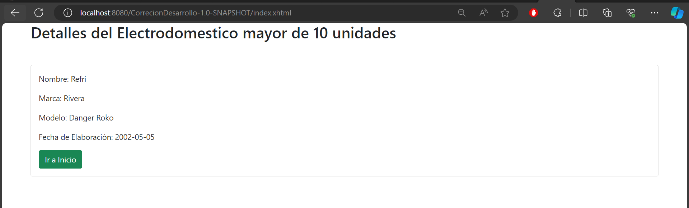
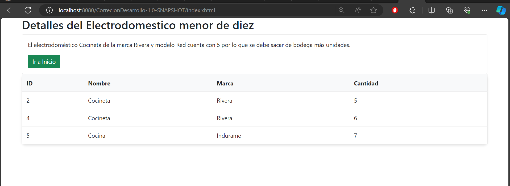
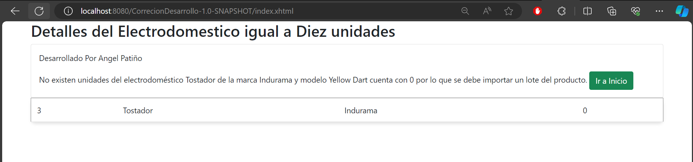

# Project Details

This project consists of a set of controllers and views related to the management of household appliances.

## **Select Language: 🌐**
- [Español (Spanish)](README.md)
- [English](README-en.md)

## Results
### DB Table

### Home

### Elderly of 10 

### Minor of 10

### Equals 0

# Below are the relevant files:

## Class `BuscarElectroBean`

The file `BuscarElectroBean.java` contains a controller responsible for searching for a household appliance based on a provided code. If the appliance exists, it determines whether the available quantity is greater than 10, between 1 and 10, or equal to 0. These cases are handled by redirecting to different pages.

### Main Methods

- `buscarElectro()`: Method that performs the search for the household appliance and determines the action to take based on the available quantity.

## Class `ElectrodomesticoManagerBean`

In the file `ElectrodomesticoManagerBean.java`, another controller is found that manages the list of household appliances and their details.

### Main Methods

- `buscarElectrodomestico()`: Method that uses the `BuscarElectroBean` to search for a household appliance.
- `getElectrodomesticos()`: Method that returns the list of all available household appliances.
- `getProductosMenosDeDiezUnidades()`: Method that returns the list of household appliances with less than 10 units available.
- `getProductosConCeroUnidades()`: Method that returns the list of household appliances with 0 units available.

## XHTML Views

The XHTML files in this project are used to display the user interface. These files contain forms and tables to interact with the controllers and display the results.

## Developer

This project was developed by Angel Patiño.
